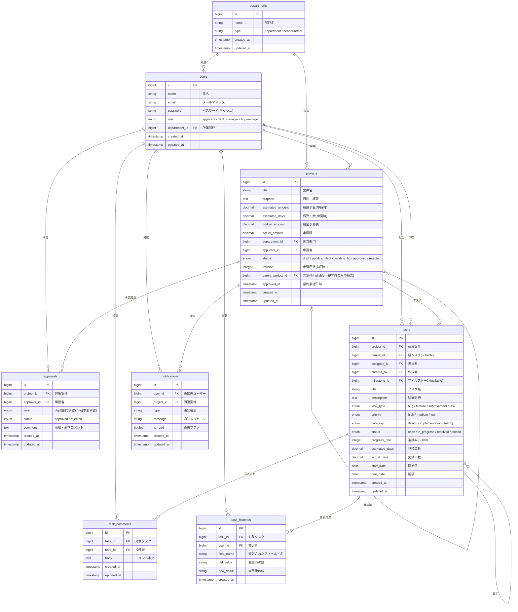

# ER図（v5） - 開発管理統合アプリケーション

## テーブル一覧（PoC：8テーブル）

| # | テーブル名 | 説明 |
|---|--------|------|
| 1 | departments | 部門 |
| 2 | users | ユーザー |
| 3 | projects | 案件（予算含む） |
| 4 | approvals | 承認履歴 |
| 5 | tasks | タスク（Backlog風） |
| 6 | task_comments | タスクコメント |
| 7 | task_histories | タスク変更履歴 |
| 8 | notifications | 通知 |

## 将来拡張用の nullable FK カラム（既存テーブルに配置済み）

| カラム | テーブル | 将来追加するテーブル | 用途 |
|--------|---------|-----------------|------|
| tasks.parent_id | tasks | — (自己参照) | 親子タスク管理 |
| tasks.milestone_id | tasks | milestones | ガントチャート対応 |

## 将来追加するテーブル（機能実装時に作成）

| テーブル | 用途 | 既存テーブルへの影響 |
|---------|------|-----------------|
| milestones | マイルストーン管理・ガントチャート | tasks.milestone_id で参照 |
| project_members | 案件へのメンバーアサイン | project_id + user_id の中間テーブル |
| budget_items | 費目別予算管理 | project_id で参照 |
| task_attachments | タスクへのファイル添付 | task_id で参照 |
| project_comments | 案件レベルのコメント | project_id で参照 |
| project_attachments | 案件へのファイル添付 | project_id で参照 |

## ER図



---

## ステータス・区分値一覧

### projects.status
| 値 | 説明 |
|---|---|
| draft | 下書き |
| pending_dept | 部門承認待ち |
| pending_hq | 本部承認待ち |
| approved | 承認済み・開発中 |
| rejected | 却下 |

### departments.type
| 値 | 説明 |
|---|---|
| department | 一般部門 |
| headquarters | 本部 |

### users.role
| 値 | 説明 |
|---|---|
| applicant | 申請者 |
| dept_manager | 部門管理者 |
| hq_manager | 本部管理者 |

### tasks.task_type
| 値 | 説明 |
|---|---|
| task | タスク（デフォルト） |
| bug | バグ |
| feature | 機能追加 |
| improvement | 改善 |

### tasks.priority
| 値 | 説明 |
|---|---|
| high | 高 |
| medium | 中（デフォルト） |
| low | 低 |

### tasks.status
| 値 | 説明 |
|---|---|
| open | 未着手 |
| in_progress | 進行中 |
| resolved | 解決済み |
| closed | 完了 |

### tasks.category
| 値 | 説明 |
|---|---|
| design | 設計 |
| implementation | 実装 |
| test | テスト |
| documentation | ドキュメント |
| other | その他 |

### approvals.level
| 値 | 説明 |
|---|---|
| dept | 部門承認（一次承認） |
| hq | 本部承認（最終承認） |

### notifications.type
| 値 | 説明 |
|---|---|
| dept_approval_needed | 部門承認依頼 |
| hq_approval_needed | 本部承認依頼 |
| approved | 承認完了 |
| rejected | 却下 |
| task_due_soon | タスク期限間近 |
| budget_alert | 予算アラート |

---

## ロールとデータアクセス範囲

| ロール | 説明 | データアクセス範囲 |
|--------|------|----------------|
| applicant | 申請者 | 自身の案件・タスクのみ |
| dept_manager | 部門管理者 | 自部門の全案件・タスク |
| hq_manager | 本部管理者 | 全部門の全案件・タスク |

## 承認フロー

```
申請者(draft) → 部門管理者(pending_dept) → 本部管理者(pending_hq) → 承認(approved)
                     ↓ 却下                        ↓ 却下
                  rejected                       rejected
                  (申請者が revision+1 で再申請)
```

## 開発管理フェーズへの移行

projects.status が approved になった時点で以下が解禁される：

| 操作 | 承認前（draft〜pending） | 承認後（approved） |
|------|:---:|:---:|
| 案件情報の編集 | ○（申請者のみ） | ✕（確定済み） |
| タスクの作成・編集 | ✕ | ○ |
| 予算額（budget_amount）の確定 | ✕ | ○（承認時に自動設定） |
| 予算実績（actual_amount）の入力 | ✕ | ○ |
| 進捗率の更新 | ✕ | ○ |

## 予算管理

- `estimated_amount`: 申請時の概算予算
- `budget_amount`: 承認後の確定予算額（承認時に estimated_amount から転記）
- `actual_amount`: 実績額（申請者が随時更新）
- 消費率: `actual_amount / budget_amount × 100` で算出
- 将来的に費目別管理が必要な場合は budget_items テーブルを追加


