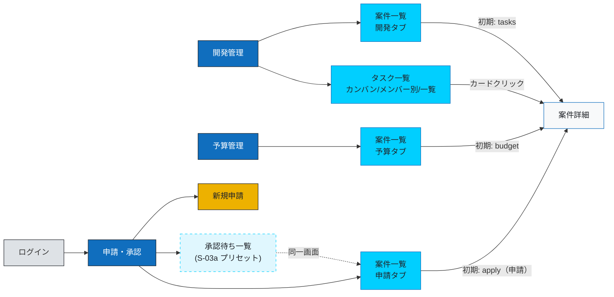
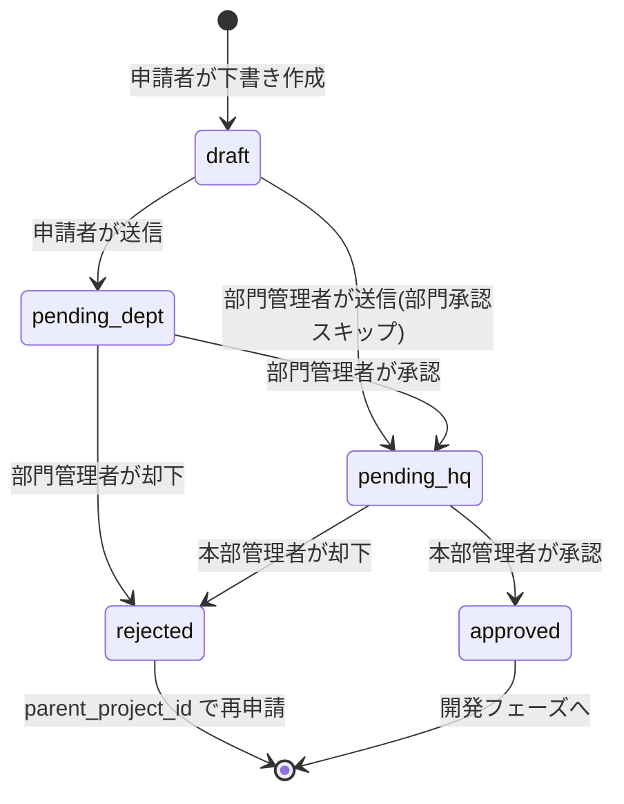
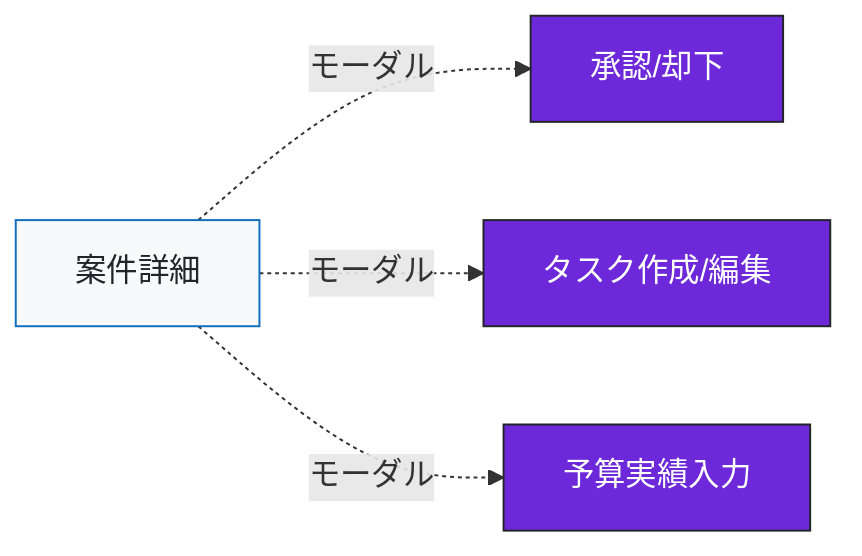

# 画面遷移設計 - 開発管理統合アプリケーション PoC

> 本ドキュメントは Claude でのモック作成と Cursor での実装指示の両方に利用することを想定。
> 画面ごとに「目的 / アクセス可能ロール / データソース / 主要UI要素 / 遷移先」を定義する。

> **スコープ方針（実装反映・2026-05-08）**
> - **課題1（必須）**: 申請・承認、開発管理、予算管理の3本柱を実装
> - **課題2（+α・企画力の提示）**: S-14 タスク一覧・S-02 ダッシュボードを実装。ガント/バーンダウン等の高度可視化は設計のみ
> - ログイン直後のホームはダッシュボードが理想だが、PoCでは **案件一覧（申請・承認タブ）** を暫定ホームとする

---

## 1. ナビゲーション構成（3セクション）

トップナビは **申請・承認 / 開発管理 / 予算管理** の3本。各セクションをクリックすると、そのフェーズで必要な画面群にアクセスできる。

| セクション | 含まれる画面 | 主なロール |
|-----------|-------------|----------|
| **申請・承認** | 新規申請 / 承認待ち一覧 / 案件一覧（申請タブ） | 申請者・部門管理者・本部管理者 |
| **開発管理** | 案件一覧（開発タブ） / 案件詳細 / タスク一覧（board/members/list） / タスク入力 | 申請者（主担当）・部門管理者（タスク運用）・本部管理者（**タスクは閲覧のみ**・方針） |
| **予算管理** | 案件一覧（予算タブ） / 予算実績入力 | 申請者（主担当）・管理者（閲覧） |

**案件一覧はセクション共通の画面**で、セクションごとに表示する列（タブ）を切り替える。詳細は §4。

---

## 2. 画面一覧

| ID | 画面名 | URL案 | 所属セクション | 目的 |
|----|-------|-------|---------------|------|
| S-01 | ログイン | `/login` | - | 認証 |
| S-03 | 案件一覧 | `/projects?tab={approval\|dev\|budget}` | 3セクション共通 | フェーズ別に列を切り替えて案件を一覧 |
| S-04 | 案件詳細 | `/projects/{id}?detailTab=...`（任意） | 開発管理（主） | 案件の全情報・承認履歴・タスク・予算 |
| S-05 | 新規申請 | `/projects/create` | 申請・承認 | 案件の新規申請フォーム |
| S-06 | 案件編集 | `/projects/{id}/edit` | 申請・承認 | draft時のみの編集 |
| S-07 | 承認待ち一覧 | `/projects?tab=approval&filter=pending` | 申請・承認 | 自分が承認すべき案件（S-03a のプリセットで実現） |
| S-08 | 承認処理モーダル | S-04内 | 申請・承認 | 承認/却下＋コメント |
| S-10 | タスク作成/編集モーダル | S-04内モーダル | 開発管理 | タスクCRUD（最小限） |
| S-11 | 予算実績入力モーダル | S-04内モーダル | 予算管理 | actual_amount の入力 |
| S-12 | 通知一覧 | `/notifications` | グローバル | アプリ内通知 |
| S-13 | プロフィール | `/profile` | グローバル | Breeze標準 |
| S-14 | タスク一覧 | `/member-tasks?view={board\|members\|list}` | 開発管理 | 部門メンバーのタスク状況を俯瞰（4値運用・カンバン/メンバー別/一覧の3ビュー） |
| S-17 | 利用マニュアル | `/manual` | グローバル | 操作手順と画面説明の参照 |

### 課題2（+α）として設計のみ行う画面（一部実装済み）
| ID | 画面名 | 状態 |
|----|-------|------|
| S-02 | ダッシュボード | 実装済み（`/dashboard`、全ロールは自スコープ表示） |
| S-09 | タスク詳細 | タスクの進捗管理|※実装済み
| S-15 | ガントチャート | マイルストーン/依存関係を含む可視化は設計のみ。実装は後回し |
| S-16 | バーンダウンチャート | 可視化は設計のみ。実装は後回し |

**PoCでは実装しない**: ユーザー管理、部門管理、ロール付与（seederで投入）。
テストアカウントの最新情報は固定記載せず、`database/seeders/UserSeeder.php` を正とする（運用情報は `doc/Design/Information.md` 参照）。

---

## 3. ロール別アクセス可視範囲

| 画面 | 申請者 (applicant) | 部門管理者 (dept_manager) | 本部管理者 (hq_manager) |
|------|:---:|:---:|:---:|
| S-03 案件一覧 | `applicant_id=self` **または** `primary_assignee_id=self`（下書き行は申請者本人のみ） | `department_id = self.dept` | 全件 |
| S-04 案件詳細 | 起票・主担当／または同部門の承認済（`ProjectPolicy::view`） | 自部門の案件 | 全件 |
| S-05 新規申請 | ○ | ○（部門承認スキップ） | × |
| S-07 承認待ち | × | `level=dept` の案件 | `level=hq` の案件 |
| S-10 タスクCRUD | 自案件（主担当）※ | 自部門（承認済案件で作成・編集可）※ | 全部門（承認済・**閲覧のみ**）※HQ |
| S-11 予算実績入力 | 自案件の主担当 | 自部門かつ承認済案件のみ可 | × |
| S-14 タスク一覧（board 既定）| 自分が `assignee_id` or `reviewer_id` のタスク | 自部門の全タスク（既定は members）| 部門選択時、選択部門の全タスク（**閲覧のみ**・既定は members）※HQ |
| S-14 タスク一覧（members）| 自部門の全タスク（**閲覧のみ**）| 自部門の全メンバー × 全タスク | 部門選択時、同上（**本部は閲覧のみ**）※HQ |
| S-14 タスク一覧（list）| 自分が `assignee_id` or `reviewer_id` のタスク | 自部門の全タスク | 部門選択時、同上（**本部は閲覧のみ**）※HQ |

※ **S-10 申請者列**: タスクの編集は主担当に加え、当該タスクの担当・確認者にも及ぶ（`ProjectWorkItemPolicy::canEditTaskContent`）。**一覧（S-03）**のクエリは `Project::scopeVisibleTo` と単体 `view` で条件が異なる場合がある（`doc/Design/role_feature_matrix.md` の照合節参照）。  
※HQ **本部管理者**はタスクを **閲覧のみ**（モーダルでの保存・DnD・コメント投稿・再オープン等の書き込みは不可）。**方針（2026-05-12）**・実装は `doc/daily/implementation_schedule.md` §3 の必須項。現行コードは未反映の可能性あり。

Controller のクエリ分岐 + Spatie Permission + Policy で実装。

---

## 4. 案件一覧（S-03）のタブ切り替え仕様

ナビゲーションから入ったセクションに応じて、デフォルトで選択されるタブと表示列が変わる。タブクリックで他フェーズの列セットにも切り替え可能。

### 4-1. 申請タブ（申請・承認セクションから流入）
**目的**: 自分が申請中のもの・ドラフト・却下されたものを追う

| 列 | 内容 |
|----|------|
| タイトル | リンク |
| ステータスバッジ | draft / pending_dept / pending_hq / approved / rejected |
| 申請日 | created_at |
| 承認ステップ | ステッパー簡易表示（課題2の要素をここに差し込む） |
| 部門 | department.name |
| 最終更新 | updated_at |

**フィルタ既定**: `status IN (draft, pending_*, rejected)`（approved は別タブで）

### 4-2. 開発タブ（開発管理セクションから流入）
**目的**: 承認済み案件の進捗を把握

| 列 | 内容 |
|----|------|
| タイトル | リンク |
| 部門 | department.name |
| 主担当 | users.name |
| タスク進捗 | 完了タスク数 / 全タスク数（課題2の一部） |
| 期限 | end_date or 最遅タスクdue |
| 最終更新 | updated_at |

**フィルタ既定**: `status = approved`

### 4-3. 予算タブ（予算管理セクションから流入）
**目的**: 予算消費状況の俯瞰

| 列 | 内容 |
|----|------|
| タイトル | リンク |
| 部門 | department.name |
| 予算額 | budget_amount |
| 実績額 | actual_amount |
| 消費率 | バー表示（0-60% 緑 / 61-85% 青 / 86-100% 橙 / 100%超 赤） |
| 更新日 | updated_at |

**フィルタ既定**: `status = approved`

**共通フィルタ**: キーワード検索、部門、優先度、期日。共通のソート（更新日降順）。

### 4-4. S-04 への遷移と初期タブ（一覧から詳細へ）

案件一覧の**どのタブから入ったか**で、S-04 内の初期表示タブを変える。実装は `resources/js/Pages/Projects/Index.tsx`（`showDetailHref`）および `Projects/Show.tsx`（`parseDetailTab`）を正とする。`components_spec.md` のモーダル文脈（S-10 はタスクタブ dim、S-11 は予算文脈 dim）と一致させる。

| 流入元 | 行クリック後の S-04 初期タブ（UIラベル） | URL クエリ（実装） |
|--------|------------------------------|-----------------------------|
| S-03 申請タブ | **申請**（申請情報・承認操作の文脈） | `?detailTab=apply`（クエリ省略時も既定は申請タブ） |
| S-03 開発タブ | **タスク** | `?detailTab=tasks` |
| S-03 予算タブ | **予算** | `?detailTab=budget` |
| S-07 承認待ち（S-03a プリセット） | **申請** | `?detailTab=apply` |

**補足**:
- クエリパラメータ名は **`detailTab` で固定**（実装済み）。
- S-04 のタブ構成は **申請 / タスク / 予算 / 履歴**（§7 参照）。`history` タブで承認履歴・変更履歴等を時系列表示する。
- 旧ドキュメントの `overview` は **`apply` と同義**。`parseDetailTab` が `overview` を `apply` に読み替える。
- タスク由来の変更履歴（`task_histories`）は **履歴タブのタイムライン** に案件イベントとして合流するほか、**タスクタブ** の一覧行を展開してタスク単位でも閲覧できる（同一データ）。
- `detailTab` の値は **`apply` | `tasks` | `budget` | `history`** の4種（後方互換で `overview` → `apply`）。

---

## 5. 画面遷移図（Mermaid）

### 5-1. 全体ナビゲーション

### 5-2. 承認ステータス遷移

### 5-3. 案件詳細内のモーダル

---

## 6. ロール別・典型フロー

### 6-1. 申請者（applicant）
1. ログイン（S-01）→ **申請・承認 → 案件一覧（申請タブ）** で自案件ステータス確認
2. 「新規申請」（S-05）で案件を起票 → `status=pending_dept`
3. 承認後、**開発管理 → 案件一覧（開発タブ）→ 案件詳細（S-04・タスクタブ初期）** でタスク作成（S-10）
4. 月末などに **予算管理 → 案件一覧（予算タブ）→ 案件詳細（S-04・予算タブ初期）→ 予算実績入力（S-11）** で actual_amount を入力
5. 通知（S-12）で承認完了・却下を受信

### 6-2. 部門管理者（dept_manager）
1. **開発管理 → タスク一覧（S-14・メンバー別ビュー初期）** で部門メンバーのタスク状況を俯瞰、期限超過/3日以内警告を確認
2. **申請・承認 → 承認待ち一覧（S-07）** で level=dept を承認/却下
3. 自部門の案件を **開発管理・予算管理** の各タブで横断把握
4. 確認待ち（resolved）タスクは S-14 から開いて **`resolved → closed`** に承認
5. 自身が申請者になる場合は S-05 から申請（部門承認スキップ）

### 6-3. 本部管理者（hq_manager）
1. **開発管理 → タスク一覧（S-14・メンバー別ビュー初期）** で部門選択し、全部門のタスクを **閲覧のみ** で横断把握（タスクの編集・作成・再オープンは行わない方針。実装は `implementation_schedule.md` §3）
2. **申請・承認 → 承認待ち一覧（S-07）** で最終承認
3. **予算管理タブ** で全部門の予算消費率を一覧（課題2：リアルタイム可視化の導線）
4. 全件閲覧

---

## 7. 画面ごとの主要UI要素

### S-03 案件一覧（共通コンポーネント）
- タブ切替UI: 申請 / 開発 / 予算（URLクエリ `?tab=` で状態保持）
- 検索・フィルタ（キーワード / 部門 / 期間 / ステータス）
- 「新規申請」ボタンは **申請タブ時のみ** 表示（申請者・部門管理者）
- 列はタブごとに §4 に従って切替
- **申請タブのデータ**: `ProjectController@index` が `projects[].purpose`（目的・概要）および却下行向けに `rejectedAt`（最新却下が部門／本部のとき `dept`|`hq`）・`rejectedComment`（最新却下コメント、空は `null`）を返す（フロントで未使用フィールドがあれば実装側でマッピング追随）

### S-04 案件詳細
- ヘッダー: タイトル・ステータスバッジ・部門・申請者・主担当
- **タブ切替**: **申請** / タスク / 予算 / 履歴（実装: `detailTab=apply|tasks|budget|history`）。一覧からの遷移時は §4-4 の初期タブを適用する
- **承認ステッパー**: 申請 → 部門承認 → 本部承認 → 承認済（課題2要素だが設計として入れる）
- 本部承認直後、初期タスク `実装計画作成`（見積 3 人日、担当者=申請者）を自動作成
- セクション:
  - 概要（purpose / estimated_amount / budget_amount / actual_amount / 消費率バー）
  - タスク一覧（テーブル表示、承認後に表示。各行から「変更履歴」を展開して `task_histories` を表示可能）
  - 承認履歴（approvals）
  - 変更履歴（承認イベントに加え、タスクの変更履歴を時系列で表示）
- 右サイド: 承認/却下ボタン（権限者）・編集（draft時の申請者）・予算実績入力（主担当）

### S-05 新規申請
- フォーム: タイトル / 目的 / 部門 / 概算予算 / 説明
- 送信 → `pending_dept`（申請者）/ `pending_hq`（部門管理者）

### S-07 承認待ち一覧（S-03a のプリセット表示）
- 独立画面は持たず、S-03a 案件一覧（申請タブ）を `?filter=pending` でプリセット表示する形で実現する
- dept_manager: `status = pending_dept` かつ `department_id = self.dept`
- hq_manager: `status = pending_hq`（全部門）
- UI は S-03a と完全共通。タイトル下に「承認待ち」バッジで文脈を示す
- サイドバーの「承認待ち一覧」メニューはこの URL へのショートカットとして機能する

### S-10 タスク作成/編集モーダル
- タイトル / 種類 / 優先度 / カテゴリ / ステータス / 担当 / 確認者 / 期日 / 進捗率
- **本部管理者**は閲覧のみ（保存・ステータス変更不可・方針。実装は `implementation_schedule.md` §3 マスト #9）
- S-14（board/members/list）からも同一モーダル（`ProjectTaskDialog`）を利用
- 課題1では本部承認時に初期タスク `実装計画作成`（見積 3 人日、担当者=申請者）を自動投入し、以降の詳細分解を S-10 で行う

### S-11 予算実績入力モーダル
- 課題1（インターン期間中）: actual_amount の入力のみ（月次で上書き運用）
- 課題2（インターン後）: 追加支出（increment）方式 + 履歴記録に拡張

### S-14 タスク一覧（部門メンバータスク + 個人タスク）
- **ビュートグル**: カンバン / メンバー別 / 一覧（URLクエリ `?view=board|members|list` で状態保持、ピル型トグル）
- **ロール別の初期ビュー**: applicant=board / dept_manager・hq_manager=members
- **フィルタ**: キーワード / 部門（dept_managerは自部門固定 disabled、hq_managerは選択必須）/ 担当者 / 案件 / 優先度 / 期日（期限超過・3日以内・今週・今月・期日未設定）
- **カンバンビュー（board）**: 4列（未着手 / 進行中 / 確認待ち / 完了）
  - 完了は直近30日のみ表示（クエリで強制）
  - カード上段に `PRJ-XXXX` + **案件名併記** + 種別チップ
  - カード枠色: 通常=灰、期限超過=赤、3日以内=橙、確認待ち=紫
  - 進行中のみ進捗ミニバー、確認待ちのみ確認者ライン、完了のみ取り消し線
- **メンバー別ビュー（members）**: **マトリクス UI**（5カラム grid: `メンバー / 未着手 / 進行中 / 完了 / 合計`）
  - `resolved` タスクは完了列内に「確認待ち」アイコン付き紫枠カードで併記（独立列にはしない）
  - **メンバー情報ペイン（列1・240px）**: アバター大・氏名・ロール・サマリバッジ群（超過 N / 3日以内 N / 確認待ち N / 確認依頼 N / 順調）・**負荷バー（担当数 / 8件固定・色分け4段階）**
  - **合計列（列5・90px）**: メンバーごとの担当タスク総件数（mono大きめ表示）
  - ソート切替: 期限超過多い順（既定）/ 担当数多い順 / 進行中多い順 / 名前順
  - **KPI ストリップ**（マトリクス上に4カード）: 部門合計 / 期限超過 / 3日以内 / 完了率
  - 折りたたみは行わず、全メンバーを並列表示（タスク0件のセルは「—」表示）
- **アクセス制御**: members ビューは全ロール閲覧可。閲覧 OK / 編集 NG を Policy で分離。**本部管理者はタスク編集不可**（閲覧のみ・方針、マスト #9）
- **一覧ビュー（list）**: S-04 開発管理準拠のテーブル（タイトル/種類/優先度/ステータス/担当/確認者/期日）
  - ステータス列にバッジ + 進捗バー + 進捗率を表示
  - 行クリックで `ProjectTaskDialog` を開く
- **キーワード検索対象**: `title`, `description`, `id`, `assignee.name`, `reviewer.name`, `project.title`
- **動線**: カードクリック → タスクモーダル（S-10 流用。**本部は閲覧のみ**・マスト #9）/ 案件名クリック → S-04 案件詳細
- **詳細仕様**: `mockups/s14_policy.md` 参照

### S-12 通知一覧
- 通知は時系列（新しい順）で表示
- 各通知は「タイトル / 通知種別バッジ / 未読バッジ / 本文 / 作成日時 / 案件導線」を表示
- 通知種別バッジは課題1で以下を表示:
  - `project_submitted`（申請）
  - `project_approved`（承認）
  - `project_rejected`（却下）
  - `project_returned`（取り戻し）
  - `task_assigned`（担当通知）
  - `task_due_soon`（期限間近）
  - `task_resolved`（完了報告・確認依頼）— 4値運用で追加
  - `task_reviewed`（確認OK・実装者と申請者へ）— 4値運用で追加
  - `task_completed`（タスク完了）

---

## 8. Claude → Cursor への渡し方（運用メモ）

- Claude で HTML モックを1画面ずつ作成（`/mockups/s0x_*.html`）
- 確定したUIを Cursor に持っていき、Inertia の Page コンポーネントとして実装
- ルーティング（§2のURL案）は `routes/web.php` へ
- 権限分岐（§3）は Spatie Permission + Policy で実装

---

## 9. 決定事項（実装反映）

- タスクCRUD: **モーダル**で実装（S-04案件詳細内）
- ダッシュボードのグラフライブラリ（課題2設計用）: **Recharts**（実装時）/ **Chart.js**（HTMLモック時）
- カンバン表示: **PoCに含める**（S-14 の board ビューで実装）
- 案件一覧は **1画面 + タブ切替** で実装（セクションごとに画面を分けない）
- ログイン直後のランディング: **案件一覧（申請タブ）** を暫定ホームに
- S-03 各タブから S-04 へ行くときの**初期表示タブ**は §4-4 に従う（開発→タスク、予算→予算、申請→**申請（apply）**）
- S-04 のタブ構成は **申請（apply） / タスク / 予算 / 履歴**。`history` タブ内で承認履歴・変更履歴を上下に並列表示する（タブ数は増やさない）。タスクの変更内容は `task_histories` を参照
- タスク変更履歴の自動記録は `TaskHistoryService`（作成・更新・初期タスク投入時）。編集 UI は S-10 相当モーダル（実装: `ProjectTaskDialog.tsx`）
- S-07 承認待ち一覧は**独立画面を持たず**、S-03a を `?filter=pending` でプリセット表示することで実現する（サイドバーのメニューはショートカット URL）
/**更新完了**/