# 開発管理アプリ ProjNexus 利用マニュアル

> 案件・タスク・予算統合管理アプリケーション（JPT 社内インターンシップ課題 PoC）の操作マニュアルです。
> 対象読者：本アプリを実際に使用する社内ユーザー（申請者・部門管理者・本部管理者）。
> 最終更新日：2026-04-30 ／ 対象ブランチ：`feat/phase5-finalization`（Phase 3 マージ済み）


## 1. はじめに

### 1.1 このマニュアルの目的

本アプリは、これまで申請システム・部門 Excel・予算管理 Excel に分散していた業務を **一つの Web アプリ** に統合し、案件の申請から承認、開発タスクの進捗管理、予算実績の管理までを一元的に扱うためのものです。

このマニュアルは、各ロールのユーザーが日常業務で必要となる操作を、画面ごとの手順と業務ルール（状態の意味・誰が何をできるか）の両面から説明します。

### 1.2 対象読者と前提知識

| 読者 | 期待する前提 |
|---|---|
| 申請者（一般社員） | 業務で扱う案件を申請し、進捗・予算を入力する立場 |
| 部門管理者 | 自部門の案件を一次承認する立場。自身でも案件を申請できる |
| 本部管理者 | 全社の案件を最終承認する立場 |

操作を始める前に、§2「5つの状態と承認フロー」を読むことを推奨します。

### 1.3 用語の定義

本マニュアルでは、システム上の英語表記と日本語表記を以下のとおり対応させます。以降は基本的に日本語表記を使います。

| 日本語表記 | システム表記 | 説明 |
|---|---|---|
| 申請者 | applicant | 案件を起案するロール |
| 部門管理者 | dept_manager | 自部門の案件を一次承認するロール |
| 本部管理者 | hq_manager | 全社の案件を最終承認するロール |
| 案件 | project | 申請単位の業務テーマ。承認後に開発・予算管理の対象となる |
| タスク | task / project_work_item | 案件配下の作業単位 |
| 主担当 | primary_assignee | 案件の責任者。申請者が初期値となる |

---

## 2. 前提：5つの状態と承認フロー

### 2.1 案件の5つの状態

すべての案件は次の5状態のいずれかにあります。状態によって編集可否・操作可否・表示位置が変わります。

| 状態 | 表示名 | 意味 | 主な遷移先 |
|---|---|---|---|
| `draft` | 下書き | 申請前の編集中。申請者のみ閲覧可 | → 部門承認待ち（または本部承認待ち） |
| `pending_dept` | 部門承認待ち | 部門管理者の承認を待っている | → 本部承認待ち／却下／（取り戻し）下書き |
| `pending_hq` | 本部承認待ち | 本部管理者の最終承認を待っている | → 承認済／却下 |
| `approved` | 承認済 | 最終承認が完了し、開発・予算管理の対象になる | （以降の状態遷移なし。編集ロック） |
| `rejected` | 却下 | 部門または本部で却下された | → 再申請（新しい案件として作成） |

### 2.2 承認フロー（状態遷移図）

通常経路（申請者が一般社員）：

```
[下書き]
    │ 申請する
    ▼
[部門承認待ち]
    │ 部門管理者が承認
    ▼
[本部承認待ち]
    │ 本部管理者が承認
    ▼
[承認済]  ──→  タスク管理・予算実績入力が解禁
```

特殊経路（申請者自身が部門管理者の場合 = 本部直行）：

```
[下書き]
    │ 申請する
    ▼
[本部承認待ち]   ※部門承認をスキップ。一覧画面に「本部直行」バッジが表示される
    │ 本部管理者が承認
    ▼
[承認済]
```

却下時：

```
[部門承認待ち or 本部承認待ち]
    │ 却下
    ▼
[却下]
    │ 内容を編集
    │ 再申請する
    ▼
[新しい案件として再申請]   ※元案件は「却下」のまま履歴として残る
                            ※新案件には「改訂2回目」「再申請チェイン: 元案件 #N」が表示される
```

取り戻し（Draft への巻き戻し）：

```
[部門承認待ち]                    [本部承認待ち（本部直行のみ）]
        │                                │
        └───── 申請者が「取り戻して下書きに戻す」─────┘
                            │
                            ▼
                       [下書き]
```

> 取り戻しは、まだ承認・却下が一度も入っていない承認待ち案件のみ可能です。一般社員が出した本部承認待ち（部門承認済の案件）は取り戻しできません。

### 2.3 ロール別「できること」マトリクス

| 機能 | 申請者 | 部門管理者 | 本部管理者 |
|---|:---:|:---:|:---:|
| 新規案件の申請 | ○ | ○（本部直行） | × |
| 案件の編集 | ○（下書き／却下のみ） | × | × |
| 申請の取り戻し | ○（条件付き） | × | × |
| 部門承認・部門却下 | × | ○（自部門のみ） | × |
| 本部承認・本部却下 | × | × | ○（全件） |
| 案件一覧の閲覧範囲 | 自分の申請＋主担当案件＋自分の下書き | 自部門の案件すべて | 全案件 |
| タスクの作成・編集 | ○（承認済かつ自分が主担当） | ○（自部門の承認済案件） | **閲覧のみ**（全承認済案件を見られるが、**書き込みは行わない**・方針。実装は `implementation_schedule.md` §3 マスト #9） |
| 予算実績の入力 | ○（承認済かつ自分が主担当） | ○（自部門の承認済案件） | ×（閲覧のみ。入力は主担当・部門管理者） |
| 通知の受信 | 自申請に関するもの | 自部門の承認依頼など | 本部承認依頼など |

> 案件の作成権限を持つのは「本部管理者ではないロール」、つまり申請者と部門管理者です。本部管理者は案件を起案できません（承認専任）。

---

## 3. 共通操作

### 3.1 ログイン

ブラウザで `http://<サーバーのアドレス>/login` にアクセスし、メールアドレスとパスワードを入力します。

**動作確認用のテストアカウント**（`UserSeeder` で作成されます。パスワードはすべて `password`）：

| メールアドレス | 氏名 | 部門 | ロール |
|---|---|---|---|
| `applicant@example.com` | 申請 太郎 | 開発1部 | 申請者 |
| `dept@example.com` | 部門 花子 | 開発1部 | 部門管理者 |
| `hq@example.com` | 本部 一郎 | 本部 | 本部管理者 |
| `applicant2@example.com` | 申請 次郎 | 開発2部 | 申請者 |
| `dept2@example.com` | 部門 慎二 | 開発2部 | 部門管理者 |
| `applicant3@example.com` | 申請 三郎 | 開発3部 | 申請者 |
| `dept3@example.com` | 部門 美咲 | 開発3部 | 部門管理者 |

ログイン後はトップページから自動的に `/projects?tab=approval`（案件一覧の申請タブ）へ移動します。

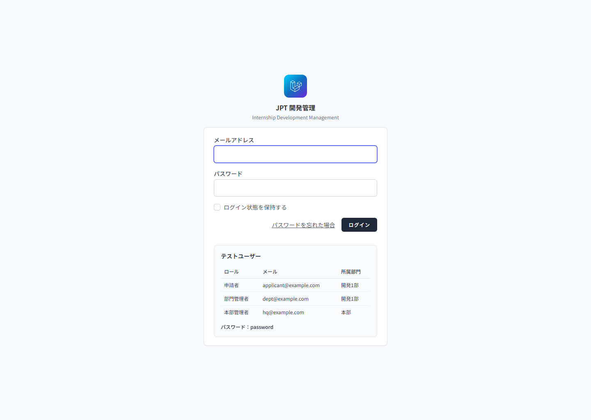
*ログイン画面。フォーム下にテストユーザー一覧と共通パスワードが表示される*

### 3.2 画面構成（サイドバー・ヘッダー）

ログイン後の全画面は共通の左サイドバー＋上部ヘッダー構成です。

- **左サイドバー**：3つのセクションに分かれています。
  - 申請・承認（案件一覧の申請タブ、新規申請、承認待ちフィルタ）
  - 開発管理（案件一覧の開発タブ）
  - 予算管理（案件一覧の予算タブ）
- **ヘッダー**：右上の通知ベルから未読通知一覧を開けます。プロフィール／ログアウトもヘッダーから操作します。

### 3.3 案件一覧の見方（3つのタブ）

`/projects` には 3 つのタブがあり、表示する列と対象案件が変わります。タブ切替は URL の `tab` パラメータで行われます。

| タブ | URL | 対象 | 主な表示列 |
|---|---|---|---|
| 申請 | `?tab=approval` | 申請フェーズの案件（下書き／部門承認待ち／本部承認待ち／却下／承認済） | タイトル・ステータス・承認ステップ・申請日・部門・最終更新 |
| 開発 | `?tab=dev` | 承認済かつ開発進行中の案件 | タイトル・部門・主担当・タスク進捗・期限・最終更新 |
| 予算 | `?tab=budget` | 承認済の案件 | タイトル・部門・予算額・実績額・消費率・更新日 |

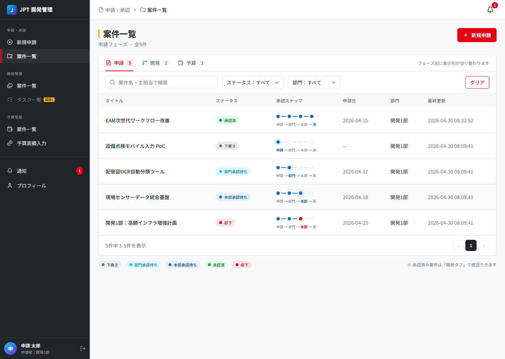
*案件一覧 申請タブ。承認ステップ列で進捗が一目で分かる*

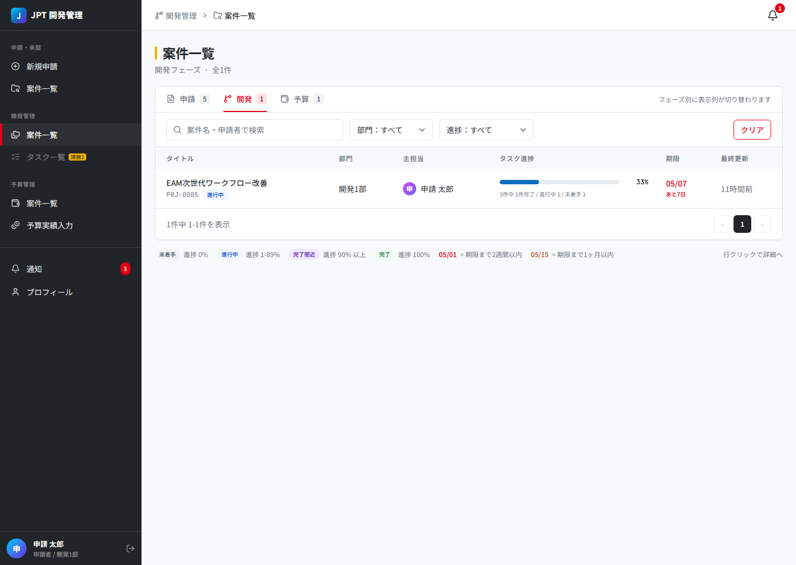
*案件一覧 開発タブ。タスク進捗バーと期限の警告色を確認できる*

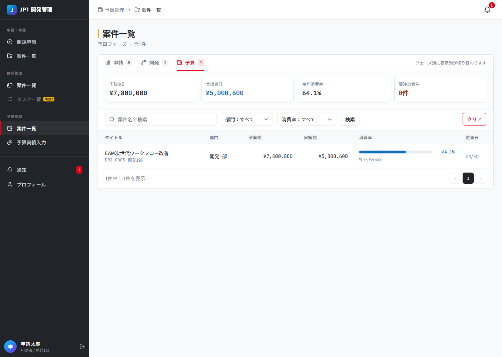
*案件一覧 予算タブ。上部に予算合計・実績合計・平均消費率・要注意件数のサマリ*

#### 申請タブのフィルタ

- 案件名・主担当のキーワード検索
- ステータス：すべて／下書き／部門承認待ち／本部承認待ち／却下
- 部門：すべて／（部門名）

#### 開発タブのフィルタ

- 案件名・申請者のキーワード検索
- 部門
- 進捗：すべて／未着手（0%）／進行中／完了間近（90%以上）／完了

#### 予算タブのフィルタ／サマリ

画面上部に予算合計・実績合計・平均消費率・要注意案件数のサマリが表示されます。

- 部門
- 消費率：すべて／60%未満／60-85%／86-100%／100%超

#### 進捗バンドと消費率の色分け

| 進捗バンド | 進捗率 | 色 |
|---|---|---|
| 未着手 | 0% | グレー |
| 進行中 | 1〜89% | 青 |
| 完了間近 | 90〜99% | 紫 |
| 完了 | 100% | 緑 |

| 消費率 | 範囲 | 色 |
|---|---|---|
| 安全 | 60% 未満 | 緑 |
| 通常 | 60〜85% | 青 |
| 警告 | 86〜100% | 黄 |
| 危険 | 100% 超過 | 赤 |

### 3.4 通知一覧

ヘッダー右上の通知ベル、または `/notifications` から通知一覧を開けます。発行される通知の種類は次のとおりです。

| 種類 | 発生タイミング | 受信者 |
|---|---|---|
| 申請受付 | 申請者が新規申請または再申請したとき | 申請者本人（既読扱い）／次の承認者 |
| 案件承認 | 部門承認・本部承認が行われたとき | 申請者 |
| 案件却下 | 却下されたとき | 申請者（本部却下時は加えて、過去に部門承認したユーザー） |
| タスク割り当て | タスクが新たに割り当てられたとき | 担当者 |
| タスク完了 | タスクが完了になったとき | 関係者 |
| タスク期限間近 | 期限が近づいたとき | 担当者 |

各通知の右側にある「既読にする」を押すと既読になります。

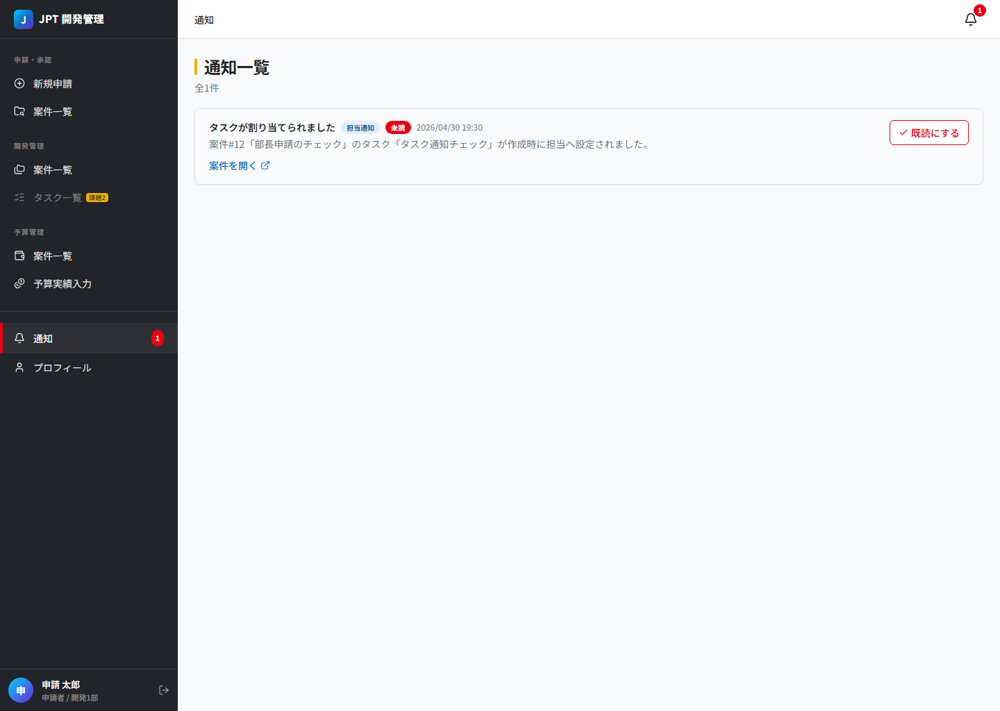
*通知一覧。種類ごとにアイコンが付き、右側に既読化ボタンがある*

---

## 4. 申請者向けガイド

> 対象ロール：申請者（および本部直行で起案する部門管理者）
> 対象画面：案件一覧（申請タブ）／新規申請／案件編集／案件詳細／タスクモーダル／予算実績モーダル

承認済案件を例にとると、案件詳細画面では「申請」「履歴」「タスク」「予算」の 4 タブが表示され、フェーズに応じて操作可能なタブが切り替わります（未承認・却下の案件では「タスク」「予算」タブは非表示）。

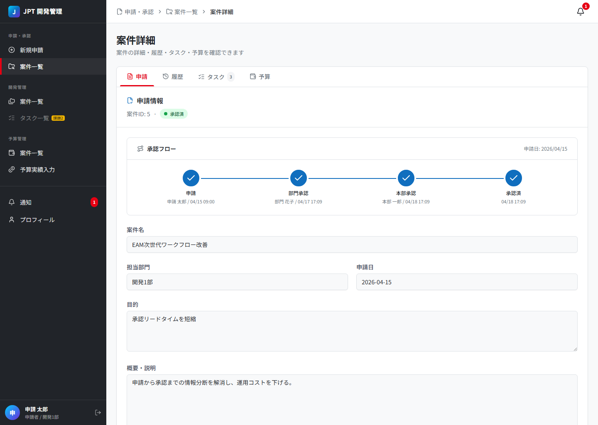
*承認済案件の申請タブ。承認フロー（申請→部門承認→本部承認→承認済）の 4 ステップすべてが完了している*

### 4.1 新規案件を申請する

**前提**：本部管理者ロールでは新規申請できません。

1. 左サイドバーの「申請・承認 ＞ 新規申請」をクリック、または案件一覧の右上の「新規申請」ボタンを押します。
2. 画面上部の「申請フロー」インジケータで、自分の申請が経由する承認段階（部門→本部、または本部直行）が確認できます。
3. 「案件情報」フォームに入力します。

| 項目 | 必須 | 説明 |
|---|:---:|---|
| 案件名 | ○ | 80文字まで。一覧で識別しやすい名称を推奨 |
| 担当部門 | △ | 申請時必須。部門管理者がこの部門の承認者として割り当てられます |
| 目的 | △ | 申請時必須。承認者の投資判断材料となる最重要項目 |
| 概要・説明 | × | 任意。承認後は編集できないため可能な範囲で詳細に |
| 概算予算 | △ | 申請時必須。承認時に「確定予算」として確定し、以降変更不可 |
| 概算工数 | × | 任意。タスク合計見積との比較参考値（人日） |
| ファイル添付 | × | 課題2で実装予定（現時点では使用不可） |

> 「下書き保存」だけは案件名のみで保存できます。「申請する」を押すには、上表で「△」の必須項目をすべて入力する必要があります。

4. 画面下部のボタンから次のいずれかを選びます。

   - **下書き保存**：そのまま帰宅して翌日続きを書く、というような使い方ができます。状態は「下書き」になります。
   - **申請する**：確認モーダルで遷移先ステータス（部門承認待ち／本部承認待ち）と次の承認者を確認したうえで実行します。

5. 申請が成功すると、案件一覧の申請タブに新しい案件が現れ、ステータスが「部門承認待ち」（一般社員）または「本部承認待ち」（部門管理者）になります。

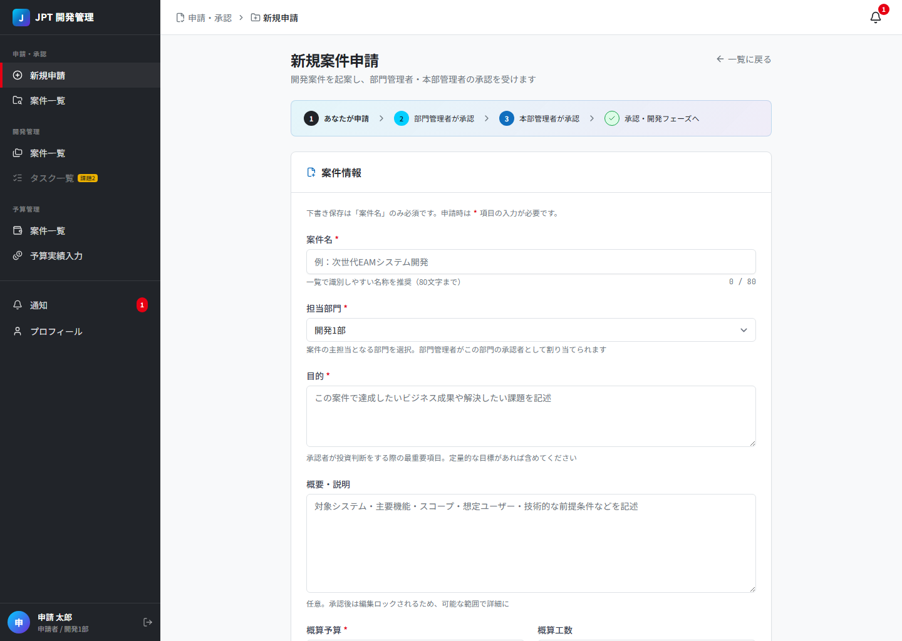
*新規申請フォーム。画面上部に承認フローのインジケータ、下部に「下書き保存」と「申請する」ボタンが並ぶ*

### 4.2 下書きを編集する

1. 案件一覧の申請タブを開き、ステータスフィルタで「下書き」を選択します。
2. 行をクリックすると編集画面に遷移します（下書きは詳細画面ではなく直接編集画面に入ります）。
3. 内容を更新し、「更新を保存」または「更新して申請」を押します。

> 下書きは申請者本人にしか見えません。他のユーザーには表示されません。

### 4.3 申請を取り戻して下書きに戻す

申請後でも、まだ承認・却下が一度も行われていない場合は取り戻し（Draft への巻き戻し）ができます。

| 取り戻せるケース | 取り戻せないケース |
|---|---|
| 自分の案件が「部門承認待ち」 | 「部門承認待ち」だが他人の案件 |
| 部門管理者が自分で起案して「本部承認待ち（本部直行）」になっている | 一般社員が起案して部門承認済→「本部承認待ち」になっている |

操作手順：

1. 案件一覧から該当案件を開きます。
2. 詳細画面右上の「取り戻して下書きに戻す」ボタンをクリックします（条件を満たす場合のみ表示されます）。
3. ステータスが「下書き」に戻り、「申請日」がクリアされます。再度編集してから申請できます。

### 4.4 却下されたら再申請する

却下された案件は、内容を引き継いで再申請できます。再申請は **新しい案件レコードとして作成** され、元案件は「却下」のまま履歴として残ります。

1. 通知またはメールで却下を受け取ります。案件一覧で該当案件は「却下」ステータスになっています。
2. 案件詳細画面を開くと、上部に却下コメントが赤いボックスで表示されます。原因を確認します。
3. 詳細画面右上の「編集」ボタンを押し、編集画面で内容を修正します。
4. 「更新して申請」を押すと、新しい案件レコードが作成されます。

   - 新案件には `parent_project_id` として元案件の ID が設定されます。
   - 新案件の詳細画面には「再申請チェイン: 元案件 #N」のリンクが表示され、元案件に戻れます。
   - 改訂回数が `revision = 2` 以降にカウントされます。

> 一度再申請して新案件が作成された後は、元の却下案件は編集も削除もできません（履歴として保全されます）。

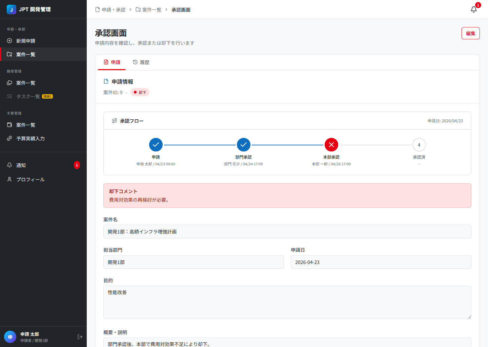
*却下された案件の詳細画面。承認フローで赤い「却下」段階が表示され、上部に却下コメントが赤いボックスで強調される*

### 4.5 タスクを登録する

タスクの作成・編集・削除は **承認済の案件のみ** 可能です。下書き・承認待ち・却下中の案件にはタスクタブが表示されません。

1. 案件詳細画面で「タスク」タブを開きます。
2. 右上の「タスク追加」ボタンをクリックします。
3. タスクモーダルで以下を入力します。

   | 項目 | 説明 |
   |---|---|
   | タイトル | タスク名 |
   | 種類 | タスク／機能追加／改善／バグ |
   | 優先度 | 高／中／低 |
   | ステータス | 未着手／進行中／完了 |
   | 進捗率 | 0〜100% |
   | 担当者 | 案件にアクセス可能なユーザーから選択 |
   | 期日 | 任意 |
   | 説明 | 任意 |

4. 保存すると一覧に行が追加されます。行をクリックすると編集モーダルが開きます。

> 本部承認直後、案件には「実装計画作成」というタスクが自動生成されます（中優先度・未着手・3日見積・申請者にアサイン）。承認直後の起点として活用してください。

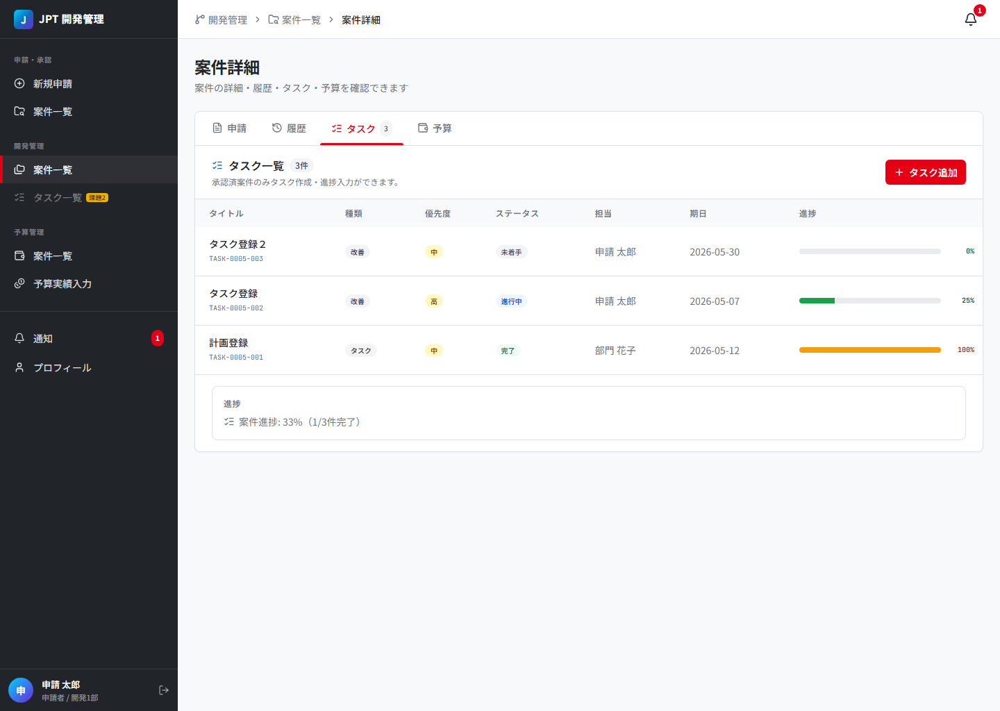
*案件詳細 タスクタブ。承認済案件のみ表示され、右上に「タスク追加」ボタン*

#### タスク履歴

タスクのフィールドを変更するたびに履歴が記録され、案件詳細の「履歴」タブで時系列で確認できます。記録される項目はタイトル・種類・優先度・ステータス・進捗率・担当者・期日・説明です。

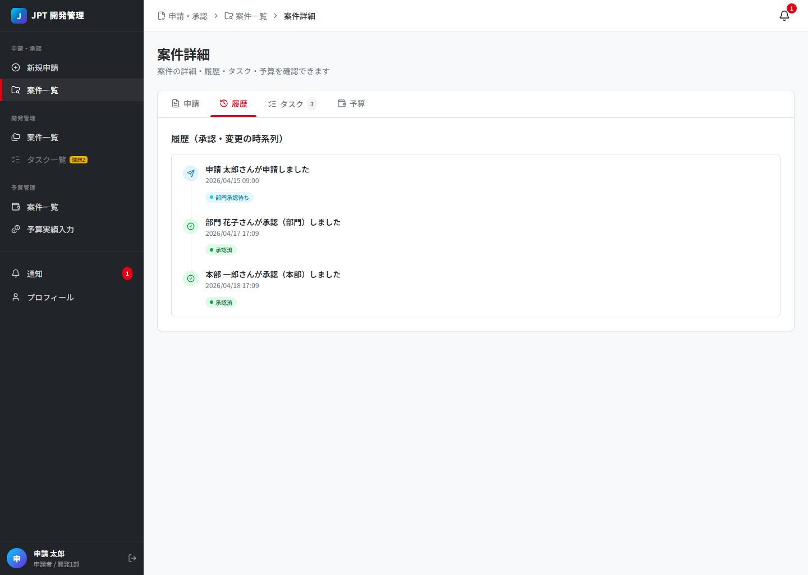
*履歴タブ。申請・承認・タスク変更が時系列で並ぶ*

### 4.6 予算実績を入力する

承認済の案件には「確定予算」（申請時の概算予算が承認時に確定したもの）が紐づきます。実績額は別途入力します。

1. 案件詳細画面で「予算」タブを開きます。
2. 「予算情報」カードの中の「実績を入力」ボタンを押します。
3. 予算実績モーダルで実績額（円）を入力します。**上書き方式**です（差額追加ではありません）。
4. 保存すると、消費率が即座に再計算されます。

#### 消費率と色分け

予算タブと予算カードでは、消費率に応じて色が変わります。

- 60% 未満：緑（安全）
- 60〜85%：青（通常）
- 86〜100%：黄（警告）
- 100% 超過：赤（危険）

> 実績額の入力は、承認済かつ「自分が主担当」または「自部門の案件」の場合に可能です。一般社員でも自分が主担当でなければ操作できません。

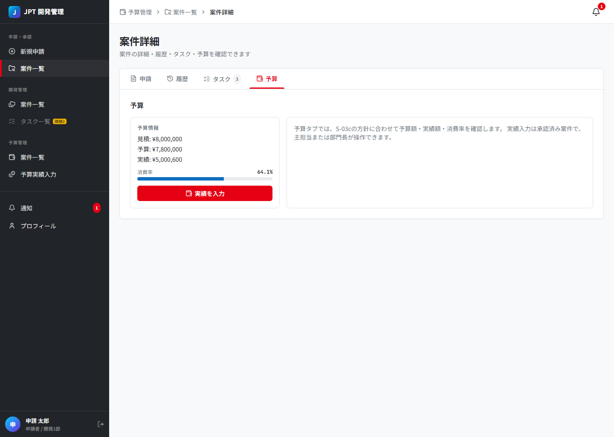
*予算タブ。見積・予算・実績の比較と消費率バーが表示される。「実績を入力」で実績モーダルを開く*

---

## 5. 部門承認者向けガイド

> 対象ロール：部門管理者
> 対象画面：案件一覧（申請タブ・承認待ちフィルタ）／案件詳細（承認画面）

### 5.1 自部門の承認待ちを確認する

1. 左サイドバー「申請・承認 ＞ 承認待ち」をクリックすると、自分が対応すべき承認待ち案件だけがフィルタされた一覧が開きます。
2. または、案件一覧の申請タブを開き、ステータスフィルタで「部門承認待ち」を選んでも同じ結果が得られます。
3. 部門管理者には自部門の案件のみが表示されます。他部門の案件は閲覧できません。

### 5.2 案件を承認・却下する

1. 一覧から該当案件をクリックします。詳細画面（タイトル：「承認画面」）が開きます。
2. 申請タブで申請内容（目的・概要・概算予算など）を確認します。承認フローでは、現在ステップ（部門承認）が青色で強調表示されます。
3. 画面下部に「却下」「承認」のボタンが表示されます（部門承認待ちの自部門案件の場合のみ）。

   - **承認** を押すと承認モーダルが開きます。コメント（任意）を入力して確定すると、ステータスが「本部承認待ち」に進みます。
   - **却下** を押すと却下モーダルが開きます。コメント（任意ですが理由の記載を推奨）を入力して確定すると、ステータスが「却下」になります。

4. 承認・却下のいずれを行っても、申請者には自動的にアプリ内通知が届きます。

> 承認・却下は **自部門かつ部門承認待ち** の案件にしか実行できません。「自部門以外」「すでに部門承認済（本部承認待ち以降）」「却下済」「承認済」の案件には承認ボタンが表示されません。

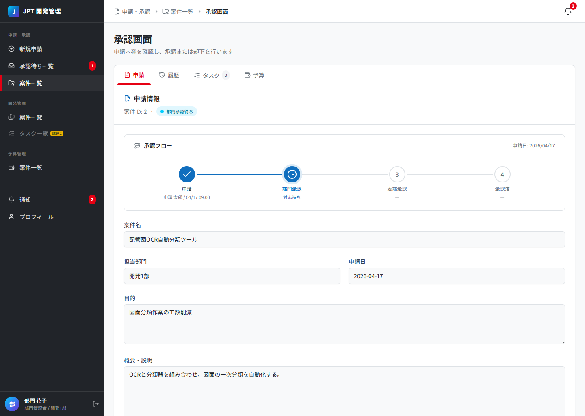
*部門承認者でログインして部門承認待ち案件を開いた状態。承認フローで現在ステップが青く強調される。下部の「承認」「却下」ボタンで処理する（本図では下部までスクロールするとボタンが表示される）*

### 5.3 自分が申請者を兼ねる場合（本部直行）

部門管理者が自分自身で案件を申請した場合、部門承認は **スキップされ、直接「本部承認待ち」** になります。

- 一覧画面では「本部直行」バッジが表示され、承認ステッパーで部門承認ステップが省略表示されます。
- 自分が申請したこの案件は、自分では本部承認できません（本部管理者が承認します）。
- 本部承認前であれば、申請者本人として「取り戻して下書きに戻す」ことが可能です。

---

## 6. 本部承認者向けガイド

> 対象ロール：本部管理者
> 対象画面：案件一覧（全タブ）／案件詳細（承認画面）

### 6.1 全案件を俯瞰する

本部管理者は全部門・全案件を閲覧できます。

- **申請タブ**：全社の申請状況を確認。承認待ちフィルタで自分が対応すべき本部承認待ちだけを抽出できます。
- **開発タブ**：承認済案件全体のタスク進捗を一覧します。期限超過や完了間近の案件を一画面で把握できます。
- **予算タブ**：承認済案件全体の予算消費状況を確認します。画面上部のサマリで予算合計・実績合計・平均消費率・要注意案件数を把握できます。

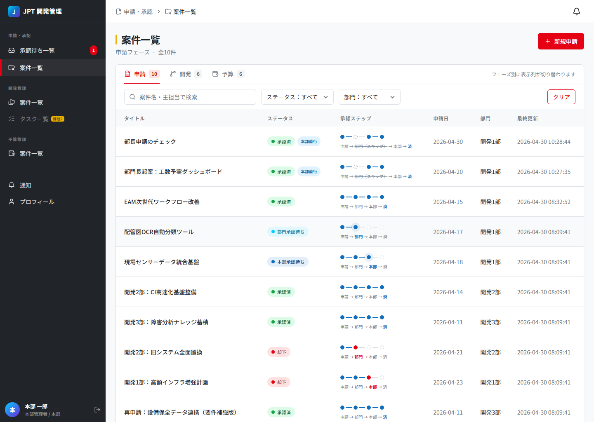
*本部管理者でログインした案件一覧。全部門の案件が表示され、左サイドバーに「承認待ち一覧」のショートカットがある*

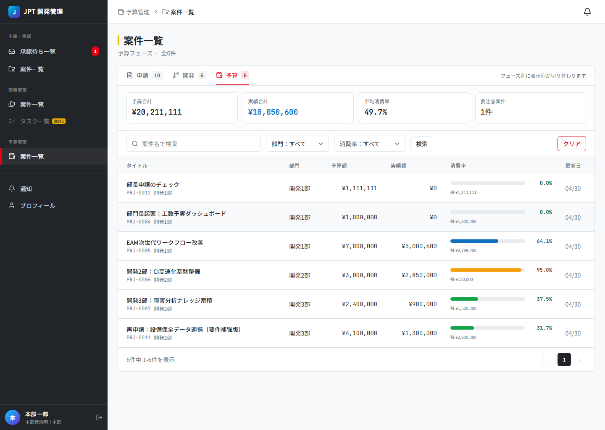
*本部管理者から見た予算タブ。全社の予算合計・消費率を俯瞰できる*

### 6.2 最終承認・最終却下する

1. 「申請・承認 ＞ 承認待ち」または案件一覧の申請タブから、ステータス「本部承認待ち」の案件を開きます。
2. 申請内容に加え、承認ステッパーで部門承認のコメント（あれば）も確認できます。
3. 画面下部の「承認」または「却下」を押し、コメントを入力して確定します。

   - **承認**：ステータスが「承認済」となり、`budget_amount` に概算予算の額が確定値として書き込まれます。同時に「実装計画作成」という初期タスクが自動生成されます。申請者に承認通知が届きます。
   - **却下**：ステータスが「却下」となります。申請者のほか、過去にこの案件を部門承認したユーザーにも本部却下の通知が届きます。

> 本部承認は **本部承認待ちの案件のみ** に実行できます。部門承認待ちの案件には承認ボタンが表示されません（先に部門承認が必要）。

### 6.3 開発・予算の進捗を監視する

承認後は、本部管理者として「開発タブ」「予算タブ」で全社の進捗・予算消費状況を監視できます。

- 開発タブの「期限」列：期限超過は赤、2 週間以内は赤、1 ヶ月以内は橙で警告色表示されます。
- 予算タブの「消費率」列：100% を超えた案件は赤、86〜100% は黄で表示され、要注意案件としてサマリにもカウントされます。

**タスクについて（方針）:** 本部管理者は **閲覧のみ** とする。タスクの新規作成・編集・ステータス変更・コメント投稿・完了タスクの再オープンは **行わない**（実装は `doc/daily/implementation_schedule.md` §3 マスト #9）。現行アプリでは操作できてしまう場合があるが、設計上の正は閲覧のみである。

**予算実績について:** 入力は **主担当** または **同部門の部門管理者**（`BudgetController`）。本部管理者は **予算実績の入力は行わない**（閲覧は開発／予算タブで可能）。

---

## 7. 状態と規則（リファレンス）

### 7.1 状態遷移の詳細表

| 操作 | 操作者 | 操作前ステータス | 操作後ステータス | 備考 |
|---|---|---|---|---|
| 新規作成（下書き保存） | 申請者・部門管理者 | （新規） | 下書き | 案件名のみで保存可 |
| 申請する（一般社員） | 申請者本人 | 下書き | 部門承認待ち | submitted_at をセット |
| 申請する（部門管理者） | 申請者本人 | 下書き | 本部承認待ち | 部門承認をスキップ |
| 申請する（再申請） | 申請者本人 | 却下 | 部門承認待ちまたは本部承認待ち | **新案件レコードを作成**。元案件は却下のまま |
| 取り戻す | 申請者本人 | 部門承認待ち／本部承認待ち（本部直行のみ） | 下書き | submitted_at をクリア |
| 部門承認 | 自部門の部門管理者 | 部門承認待ち | 本部承認待ち | approvals テーブルに記録 |
| 部門却下 | 自部門の部門管理者 | 部門承認待ち | 却下 | rejected_at をセット |
| 本部承認 | 本部管理者 | 本部承認待ち | 承認済 | approved_at／budget_amount 確定。初期タスク自動生成 |
| 本部却下 | 本部管理者 | 本部承認待ち | 却下 | 部門承認者にも通知 |

### 7.2 編集・削除の規則

| 状態 | 編集可否 | 削除可否 | 備考 |
|---|---|---|---|
| 下書き | ○（申請者本人） | ○（申請者本人） | 子案件があれば削除不可 |
| 部門承認待ち | × | × | 取り戻して下書きに戻してから編集 |
| 本部承認待ち | × | × | 同上（本部直行のみ取り戻し可能） |
| 承認済 | × | × | 編集ロック。**タスクは閲覧のみ**（本部・方針）／実績入力は主担当・部門管理者 |
| 却下 | ○（申請者本人） | ○（申請者本人） | 再申請して子案件ができたら不可 |

### 7.3 アクセス制御の詳細

#### 案件の閲覧権限

| ロール | 閲覧範囲 |
|---|---|
| 本部管理者 | 全案件 |
| 部門管理者 | 自部門の案件すべて |
| 申請者 | 自分が申請した案件、自分が主担当の案件、自分の下書き |

> 下書きは原則として申請者本人にしか見えません（部門管理者・本部管理者であっても他人の下書きは閲覧できません）。

#### タスクの操作権限

タスクの作成・編集・削除には次の両方が必要です。

1. 案件のステータスが「承認済」であること。
2. その案件にアクセスできること（閲覧権限と同じ条件）。

**本部管理者の例外（方針）:** 上記を満たしても、本部ロールは **タスクの閲覧のみ**（書き込み操作は行わない）。実装は `doc/daily/implementation_schedule.md` §3 マスト #9。

#### 予算実績の入力権限

予算実績の入力は、案件のステータスが「承認済」かつ次のいずれかを満たす場合に可能です。

- 自分が主担当
- 自部門の案件かつ部門管理者

本部管理者による予算実績の入力は **行わない**（アプリ実装 `BudgetController` にも合わせる）。

### 7.4 通知の発行タイミング

| 通知種類 | タイミング | 受信者 |
|---|---|---|
| 申請受付 | 申請（新規・再申請）した瞬間 | 申請者（既読扱い）／次のレベルの承認者全員 |
| 申請依頼 | 部門承認が完了し、本部承認待ちに移った瞬間 | 本部管理者全員 |
| 案件承認 | 部門承認・本部承認のそれぞれの瞬間 | 申請者 |
| 案件却下 | 部門却下・本部却下の瞬間 | 申請者／（本部却下時のみ）過去に部門承認した部門管理者 |
| タスク割り当て | タスクの担当者が新たに設定／変更されたとき | 担当者 |
| タスク完了 | タスクのステータスが「完了」になったとき | 関係者 |
| タスク期限間近 | 期限の前日／当日 | 担当者 |

---

## 8. よくある質問（FAQ）

### Q1. 下書きを保存したまま帰宅したい。

「下書き保存」ボタンで保存できます。案件名さえ入力されていれば必須項目が空でも保存可能です。再開時は案件一覧の申請タブでステータスフィルタを「下書き」に変えて該当行をクリックしてください。

### Q2. 申請したが、誤りに気づいた。

部門承認・本部承認のどちらも未実施であれば、案件詳細画面の「取り戻して下書きに戻す」ボタンで下書きに戻して編集できます。一般社員が出して既に部門承認された案件（本部承認待ち）は取り戻せません。その場合は本部承認者か部門承認者に「却下→再申請」を依頼してください。

### Q3. 却下されたが、原因がわからない。

案件詳細画面の上部に、却下時のコメントが赤いボックスで表示されます。コメントが空欄の場合は、承認者に直接確認してください。

### Q4. タスク追加ボタンが押せない。グレーアウトしている。

タスクの作成・編集は **承認済の案件のみ** 可能です。下書き・承認待ち・却下中の案件にはタスクタブ自体が表示されません。承認済案件であれば、自分が主担当（または自部門の部門管理者）である必要があります。**本部管理者はタスクを閲覧のみ**（方針・`implementation_schedule.md` §3 マスト #9）。

### Q5. 実績を入力するボタンが見当たらない。

予算タブの「予算情報」カード内に「実績を入力」ボタンがあります。グレーアウトしている場合は権限不足です（承認済かつ主担当以上の権限が必要）。

### Q6. 「本部直行」バッジは何を意味するか。

申請者自身が部門管理者だった場合、部門承認をスキップして直接本部承認待ちになる経路を示します。承認段階が一つ少なくなるため、申請日から承認までが速いのが特徴です。

### Q7. 再申請すると、元の案件はどうなるか。

元の案件は「却下」のまま **削除されず** 履歴として残ります。新しい案件には「改訂2回目」「再申請チェイン: 元案件 #N」のリンクが表示され、いつでも元案件を参照できます。

### Q8. 承認済の案件の概算予算を直したい。

承認時点で「概算予算」は「確定予算」（`budget_amount`）として確定し、以降は変更できません。これは予算管理の整合性を保つための仕様です。どうしても予算を変更したい場合は、運用上の対応として、別案件として再申請するか、本部管理者に相談してください。

### Q9. ダッシュボード（全社サマリ画面）はどこ？

S-02 ダッシュボードは課題2（追加機能）で実装予定です。現時点では `/dashboard` URL は案件一覧の申請タブにリダイレクトされます。全社の予算サマリは予算タブ上部の集計カードで、開発進捗は開発タブで確認できます。

### Q10. 通知が多すぎる。一括既読にしたい。

通知一覧（`/notifications`）で各通知を「既読にする」ボタンで個別に既読にできます。一括既読は現時点では実装されていません。

---

## 9. 関連ドキュメント

業務上の操作はこのマニュアルだけで完結しますが、設計の背景・仕様の正本については以下のドキュメントを参照してください。

| 内容 | パス |
|---|---|
| 課題要件・機能一覧 | `doc/Design/requirements.md` |
| 画面遷移とアクセス範囲 | `doc/Design/screen_flow.md` |
| ER 図（テーブル構造） | `doc/Design/er_diagram.md` |
| デザインシステム（カラー・タイポ） | `doc/Design/design_system.md` |
| 共通コンポーネント仕様 | `doc/Design/components_spec.md` |
| 設計思想・課題分析 | `doc/Design/design-philosophy.md` |
| システム仕様（スコープ・権限・承認の正本） | `doc/Design/system_spec.md` |
| Cursor 向け入口（作業ルール・モック一覧） | `doc/Design/AI.md` |
| HTML モック | `mockups/s03a_*.html` ほか |

不明点や不具合があれば、本マニュアルではなく上記の設計書および開発担当への問い合わせを推奨します。
