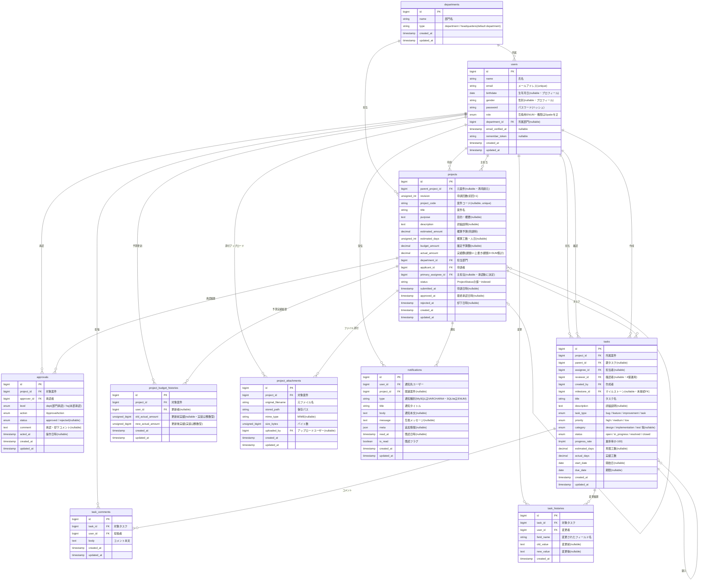

# ER図（v7） - 開発管理統合アプリケーション

> **正本の役割**: 画面・URL・権限フローは **`system_spec.md`**、Cursor 向け入口は **`AI.md`**。本ファイルは **業務テーブルの列・型・区分値・Mermaid ER** を詳細に記す。実装変更後はマイグレーションと突き合わせて本ファイルを更新する。

提出は、ER図をPDF形式で作成して提出すること

## テーブル一覧（PoC：業務10テーブル）

`system_spec.md` §5 の **業務コア9**（`project_attachments` を除く）に、**案件申請のファイル添付**用の `project_attachments` を加えた **計10** を PoC の業務スコープとする。

| # | テーブル名 | 説明 |
|---|--------|------|
| 1 | departments | 部門 |
| 2 | users | ユーザー（`birthdate` / `gender` はプロフィール任意項目） |
| 3 | projects | 案件（予算・主担当・承認ステータス含む） |
| 4 | approvals | 承認履歴 |
| 5 | tasks | タスク（Backlog風・Eloquent は `ProjectWorkItem`） |
| 6 | task_comments | タスクコメント |
| 7 | task_histories | タスク変更履歴 |
| 8 | project_budget_histories | 予算実績（`actual_amount`）更新の監査 |
| 9 | notifications | アプリ内通知 |
| 10 | project_attachments | 案件申請のファイル添付（`storage/app/project_attachments/`） |

### 補足（図に含めないテーブル）

| 区分 | テーブル例 | 備考 |
|------|------------|------|
| フレームワーク | `cache` / `cache_locks` / `jobs` / `job_batches` / `failed_jobs` / `sessions` / `password_reset_tokens` | Laravel 標準 |
| 権限（Spatie） | `roles` / `permissions` / `model_has_roles` / `model_has_permissions` / `role_has_permissions` | **ロール・権限の運用上の正**。シーダーは `syncRoles`。`users.role` 列は互換用 ENUM が残存するが、表示・認可は Spatie を正とする |

## 将来拡張用の nullable FK カラム（既存テーブルに配置済み）

| カラム | テーブル | 将来追加するテーブル | 用途 |
|--------|---------|-----------------|------|
| tasks.parent_id | tasks | — (自己参照) | 親子タスク管理 |
| tasks.milestone_id | tasks | milestones | ガントチャート対応 |

## 将来追加するテーブル（機能実装時に作成）

| テーブル | 用途 | 既存テーブルへの影響 |
|---------|------|-----------------|
| **budget_actuals** | **予算実績の追加方式（監査証跡・内訳分析）**。1支出=1行 INSERT し、`projects.actual_amount` は `SUM()` で集計 | project_id で参照。`projects.actual_amount` を冗長カラム（集計キャッシュ）扱いに変更 |
| milestones | マイルストーン管理・ガントチャート | tasks.milestone_id で参照 |
| project_members | 案件へのメンバーアサイン | project_id + user_id の中間テーブル |
| budget_items | 費目別予算管理（`budget_actuals` と組み合わせて費目ごとの予算・実績管理） | project_id で参照 |
| task_attachments | タスクへのファイル添付 | task_id で参照 |
| project_comments | 案件レベルのコメント | project_id で参照 |

> **課題1 の方針**：予算実績は `projects.actual_amount` の **上書き方式** で運用する（最小要件「案件単位の総額で可」に準拠）。  
> **課題2 の拡張**：`budget_actuals` テーブルを追加し、支出ごとに履歴を積み上げる **追加方式** に拡張。監査証跡・カテゴリ別内訳・誤入力耐性を獲得する。


## ER図



### users.role と Spatie

| 項目 | 内容 |
|------|------|
| DB | `users.role` は `enum('applicant','dept_manager','hq_manager')` で残存 |
| 運用の正 | **Spatie**（`model_has_roles` ↔ `roles`）。複数ロールもあり得る。プロフィール表示は Enum ラベル化して ` / ` 連結（`system_spec.md` §6） |
| シーダー | `UserSeeder` で `syncRoles` を使用 |

### notifications.type（DB型の差）

| ドライバ | 定義 | 備考 |
|----------|------|------|
| SQLite（PHPUnit 等） | 作成 migration 由来の CHECK 付き相当の **ENUM** | `App\Enums\NotificationType::values()` と一致必須 |
| MySQL（本番想定） | `2026_05_08_120000_notifications_type_to_varchar_mysql` で **VARCHAR(64)** | PHP Enum と列定義のずれによる INSERT 失敗を防ぐ（`Information.md` §4.1 参照） |

### task_histories（実装対応）

| 項目 | 内容 |
|------|------|
| Eloquent | `App\Models\ProjectTaskHistory`（テーブル名 `task_histories`） |
| サービス | `App\Services\TaskHistoryService` |
| 記録タイミング | タスクの作成・更新（`ProjectTaskController`）、本部承認直後の初期タスク作成（`ApprovalService`） |
| 追跡フィールド | `status`, `progress_rate`, `assignee_id`, `due_date`, `priority`（`title` / `description` / `task_type` は対象外） |
| `old_value` / `new_value` | 画面表示と揃えた文字列（例: 未着手、担当者氏名、`Y-m-d` 形式の期日、`45%`）。作成時は項目ごとに `old_value` を null、`new_value` に現在値 |
| マイグレーション | `updated_at` 列なし（`created_at` のみ） |

### project_budget_histories（実装対応）

| 項目 | 内容 |
|------|------|
| Eloquent | `App\Models\ProjectBudgetHistory`（テーブル名 `project_budget_histories`） |
| 記録タイミング | `BudgetController@update` で `actual_amount` を更新したとき（値が変わった場合のみ） |
| 記録内容 | `old_actual_amount` / `new_actual_amount` / `user_id` / `created_at` |
| 表示先 | `Projects/Show` の履歴タブ（「予算実績を更新」イベントとして時系列表示） |
| 型 | `old_actual_amount` / `new_actual_amount` は migration 上 **unsignedBigInteger**（`projects.actual_amount` の decimal(15,2) とは型が異なる。円の整数表現として運用） |

---

## ステータス・区分値一覧

### projects.status（DBは string・値は `App\Enums\ProjectStatus` に準拠）

| 値 | 説明 |
|---|------|
| draft | 下書き |
| pending_dept | 部門承認待ち |
| pending_hq | 本部承認待ち |
| approved | 承認済み・開発中 |
| rejected | 却下 |

### departments.type
| 値 | 説明 |
|---|---|
| department | 一般部門 |
| headquarters | 本部 |

### users.role（列・デフォルト申請者。表示・認可は Spatie を正）
| 値 | 説明 |
|---|---|
| applicant | 申請者 |
| dept_manager | 部門管理者 |
| hq_manager | 本部管理者 |

### tasks.task_type
| 値 | 説明 |
|---|---|
| task | タスク（デフォルト） |
| bug | バグ |
| feature | 機能追加 |
| improvement | 改善 |

### tasks.priority
| 値 | 説明 |
|---|---|
| high | 高 |
| medium | 中（デフォルト） |
| low | 低 |

### tasks.status（Backlog 風・4値）

| 値 | 説明 | 課題1 | 課題2 |
|---|---|:---:|:---:|
| open | 未着手（未対応） | ✅ 使用 | ✅ 使用 |
| in_progress | 進行中（処理中） | ✅ 使用 | ✅ 使用 |
| resolved | 確認待ち（実装者の完了報告後・確認者の確認前） | ✅ 使用 | ✅ 使用 |
| closed | 完了（確認者OK後） | ✅ 使用 | ✅ 使用 |

**運用（4値・課題1 で完全実装）**：
- 実装者（`assignee_id`）が作業完了したら **`in_progress → resolved`**（「完了報告」）
- 確認者（`reviewer_id`）が内容確認して **`resolved → closed`**（「確認OK」）
- UI のチップは「未着手 / 進行中 / 確認待ち / 完了」の 4 つ
- `reviewer_id` カラムは **課題1 で追加**（migration で nullable FK→users）。本部承認時の自動タスクでは申請者の所属部門の管理者を初期値、ユーザー作成タスクでは S-10 モーダルで明示選択
- 4値運用に伴い通知タイプ `task_resolved` / `task_reviewed` を追加（`NotificationType` enum）

**Policy（権限分岐）**：
- `in_progress → resolved`: 担当者（`assignee_id = self`）のみ
- `resolved → closed`: 確認者（`reviewer_id = self`）のみ
- 逆遷移（`closed → open` 等）: **部門管理者のみ**（本部管理者はタスク閲覧のみの方針のため再オープンは行わない。実装は `implementation_schedule.md` §3 必須項）

### tasks.category（課題1 では未使用・将来拡張用）

| 値 | 説明 |
|---|---|
| design | 設計 |
| implementation | 実装 |
| test | テスト |
| documentation | ドキュメント |
| other | その他 |

> **課題1**：DB カラムは nullable で残すが、UI には表示しない（S-10 のフォームに入力欄なし）。  
> **課題2**：Backlog のカテゴリ機能として UI に追加し、フィルタ・集計軸に活用。

### approvals.level
| 値 | 説明 |
|---|---|
| dept | 部門承認（一次承認） |
| hq | 本部承認（最終承認） |

### notifications.type（`App\Enums\NotificationType`・DBは上記「notifications.type」参照）

| 値 | 説明 |
|---|---|
| project_submitted | 申請提出 |
| project_approved | 承認完了 |
| project_rejected | 却下 |
| project_returned | 申請取り戻し |
| task_assigned | タスク担当アサイン |
| task_due_soon | タスク期限間近 |
| task_resolved | タスク完了報告（確認者宛・4値運用） |
| task_reviewed | タスク確認OK（実装者・申請者宛・4値運用） |
| task_completed | タスク完了（互換維持） |

**課題2（未実装・ER上の予定）**

| 値 | 説明 |
|---|---|
| budget_alert | 予算アラート（閾値超過通知） |

> **budget_alert** は **設計上の追加予定**。現行 `NotificationType` enum / 通知生成には未含む。実装時は NTF-01 に従い enum・マイグレ・発火ロジックを追加する。

## 実装差分の対応スケジュール（ER図準拠）

| ID | 変更内容 | 対象 | 優先度 | 予定時期 |
|---|---|---|---|---|
| NTF-01 | `notifications.type` に `budget_alert` を追加 | `app/Enums/NotificationType.php` / enum更新migration / 通知生成ロジック | 中 | 課題2着手時（`budget_actuals` 実装と同スプリント） |
| NTF-02 | 予算閾値到達時に `budget_alert` を発火 | Budgetサービス層・通知配信処理 | 中 | NTF-01 完了直後 |

---

## ロールとデータアクセス範囲

| ロール | 説明 | データアクセス範囲 |
|--------|------|----------------|
| applicant | 申請者 | 自身の案件・タスクのみ（一覧・閲覧の例外は `ProjectPolicy` / `scopeVisibleTo`・`role_feature_matrix_.md` 参照） |
| dept_manager | 部門管理者 | 自部門の全案件・タスク |
| hq_manager | 本部管理者 | 全部門の全案件・**タスクは閲覧のみ**（作成・更新・削除・ステータス変更・コメント投稿は不可・方針。実装は `materials/daily_reports/implementation_schedule.md` §3 必須項） |

## 承認フロー

```
申請者(draft) → 部門管理者(pending_dept) → 本部管理者(pending_hq) → 承認(approved)
                     ↓ 却下                        ↓ 却下
                  rejected                       rejected
                  (申請者が revision+1 で再申請)
```

## 開発管理フェーズへの移行

projects.status が approved になった時点で以下が解禁される：

| 操作 | 承認前（draft〜pending） | 承認後（approved） |
|------|:---:|:---:|
| 案件情報の編集 | ○（申請者のみ） | ✕（確定済み） |
| タスクの作成・編集 | ✕ | ○（本部管理者は **閲覧のみ**・方針。実装は `implementation_schedule.md` §3 マスト #9） |
| 予算額（budget_amount）の確定 | ✕ | ○（承認時に自動設定） |
| 予算実績（actual_amount）の入力 | ✕ | ○（本部管理者は入力しない。主担当・部門管理者） |
| 進捗率の更新 | ✕ | ○（本部管理者はタスク閲覧のみのため対象外） |

## 予算管理

### 共通（課題1・2 とも）
- `estimated_amount`: 申請時の概算予算
- `budget_amount`: 承認後の確定予算額（承認時に estimated_amount から転記）
- `actual_amount`: 実績額
- 消費率: `actual_amount / budget_amount × 100` で算出

### 課題1（PoC）- 上書き方式
- `projects.actual_amount` をユーザーが直接更新（累計額を入力）
- 支出内訳は保持しないが、更新監査のため `project_budget_histories` に更新履歴を保存
- 最小要件「案件単位の総額で可」を満たす最小構成
- S-11 予算実績入力モーダルは「実績額（円）」の単一入力欄

### 課題2（将来拡張）- 追加方式
- `budget_actuals` テーブルを追加し、1 支出 = 1 行 INSERT
- `projects.actual_amount` は `SUM(budget_actuals.amount)` の集計結果として自動更新
- カテゴリ（外注費/ライセンス/機材費/その他）・用途・適用日・メモを記録
- S-11 は「今回の支出額」を入力する形式に拡張

### さらに将来の拡張
- 費目別予算管理 → `budget_items` テーブル追加
- 月次予算管理 → `budget_actuals.applied_on` での月次集計
