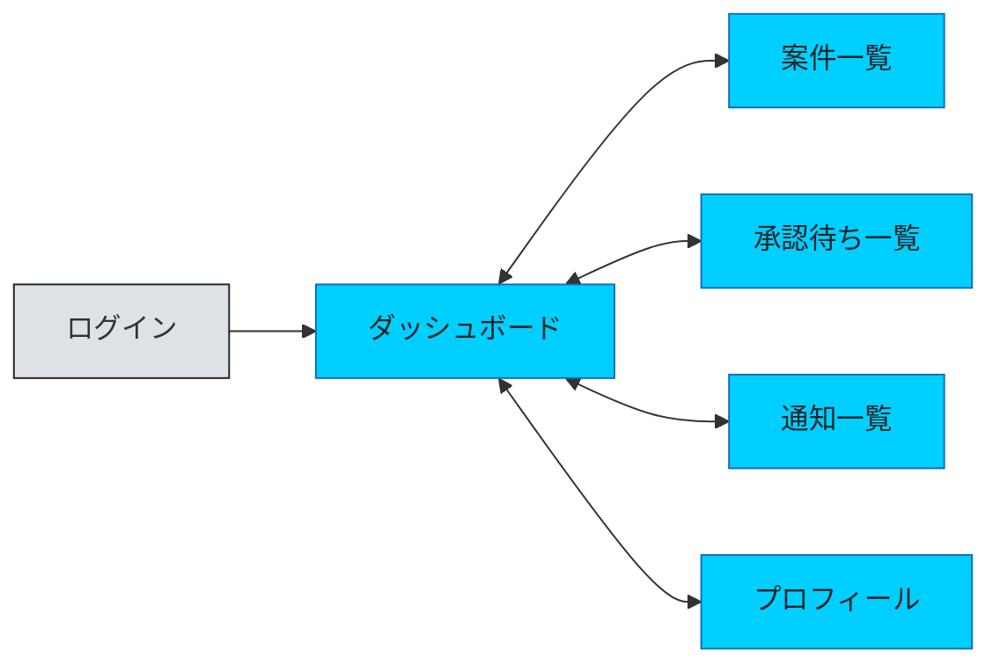
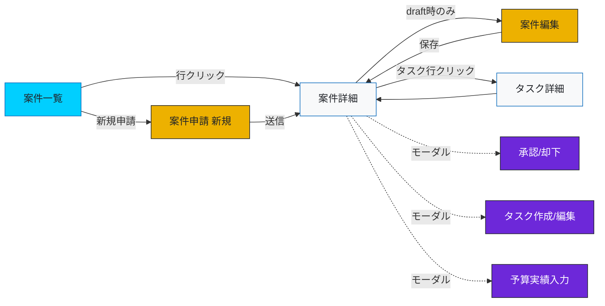
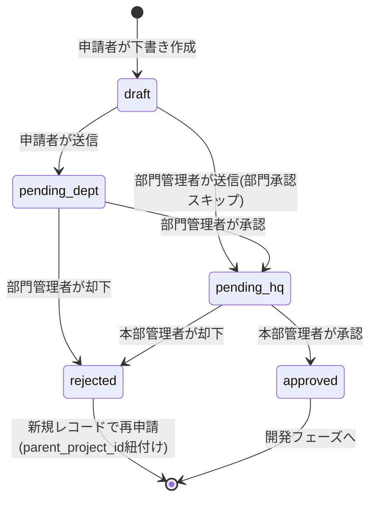

# 画面遷移設計 - 開発管理統合アプリケーション PoC

> 本ドキュメントは V0 での画面作成と Cursor での実装指示の両方に利用することを想定。
> 画面ごとに「目的 / アクセス可能ロール / データソース / 主要UI要素 / 遷移先」を定義する。

---

## 1. 画面一覧

| ID | 画面名 | 主要ロール | URL案 | 目的 |
|----|-------|----------|-------|------|
| S-01 | ログイン | 全員（未認証） | `/login` | 認証 |
| S-02 | ダッシュボード | 全員 | `/` | ロール別のホーム。自分の要対応件数＋全体状況の要約 |
| S-03 | 案件一覧 | 全員 | `/projects` | ロールに応じた可視範囲の案件をリスト表示 |
| S-04 | 案件詳細 | 全員（可視範囲内） | `/projects/{id}` | 案件の全情報・承認ステッパー・タスク一覧・予算サマリー |
| S-05 | 案件申請（新規） | 申請者・部門管理者 | `/projects/create` | 新規案件の申請フォーム |
| S-06 | 案件申請（編集） | 申請者（draft時のみ） | `/projects/{id}/edit` | 承認前の案件情報を編集 |
| S-07 | 承認待ち一覧 | 部門管理者・本部管理者 | `/approvals` | 自分が承認すべき案件のリスト |
| S-08 | 承認処理モーダル | 部門管理者・本部管理者 | S-04内モーダル | 承認/却下＋コメント入力 |
| S-09 | タスク詳細 | 案件可視範囲内 | `/projects/{id}/tasks/{task_id}` | タスクの詳細・コメント・変更履歴 |
| S-10 | タスク作成/編集 | 案件可視範囲内（承認後） | S-04内モーダル or `/projects/{id}/tasks/create` | タスクのCRUD |
| S-11 | 予算実績入力 | 申請者（主担当） | S-04内モーダル | actual_amount の入力 |
| S-12 | 通知一覧 | 全員 | `/notifications` | アプリ内通知の履歴 |
| S-13 | プロフィール | 全員 | `/profile` | 自分のアカウント情報（Breeze標準） |

**PoCでは実装しない画面**: ユーザー管理、部門管理、ロール付与（seederで投入）。

---

## 2. ロール別のアクセス可視範囲

| 画面 | 申請者 (applicant) | 部門管理者 (dept_manager) | 本部管理者 (hq_manager) |
|------|:---:|:---:|:---:|
| S-02 ダッシュボード | 自分の申請・タスク中心 | 自部門サマリー | 全部門サマリー |
| S-03 案件一覧 | `applicant_id = self` | `department_id = self.dept` | 全件 |
| S-04 案件詳細 | 自案件のみ | 自部門の案件 | 全件 |
| S-05 案件申請 | ○ | ○（部門承認はスキップ） | × |
| S-07 承認待ち | × | `level=dept` の案件 | `level=hq` の案件 |
| S-09 タスク詳細 | 自案件 | 自部門案件 | 全件 |
| S-10 タスクCRUD | 自案件 | 自部門案件 | 全件（閲覧中心） |
| S-11 予算実績入力 | 自案件の主担当 | × | × |

※ Controller のクエリ分岐で実装（設計思想ドキュメント5章）。

---

## 3. 画面遷移図（Mermaid）

### 3-1. 全体ナビゲーション（ハブ画面間の遷移）

### 3-2. 案件まわりの遷移（メインフロー）

### 3-3. 承認フロー（ステータス遷移）

---

## 4. ロール別・典型フロー

### 4-1. 申請者（applicant）

1. ログイン（S-01）→ ダッシュボード（S-02）で自案件のステータス確認
2. 「新規申請」（S-05）で案件を起票 → `status=pending_dept`
3. 承認後、案件詳細（S-04）で **タスク作成（S-10）** が解禁
4. 日々、タスク詳細（S-09）で進捗率・ステータスを更新
5. 月末などに予算実績（S-11）を入力
6. 通知（S-12）で承認完了・却下を受信

### 4-2. 部門管理者（dept_manager）

1. ダッシュボード（S-02）で自部門サマリー確認
2. 承認待ち一覧（S-07）→ 案件詳細（S-04）→ 承認モーダル（S-08）で承認/却下
3. 自部門の案件一覧（S-03）で進捗を横断把握
4. 部門管理者自身が申請者になった場合は S-05 から申請（部門承認はスキップされ、即 `pending_hq`）

### 4-3. 本部管理者（hq_manager）

1. ダッシュボード（S-02）で全部門の進捗・予算消費率を一覧（**課題2: 可視化**）
2. 承認待ち一覧（S-07）→ 最終承認（S-08）
3. 案件一覧（S-03）・案件詳細（S-04）で全件閲覧

---

## 5. 画面ごとの主要UI要素（V0プロンプト用の素材）

### S-02 ダッシュボード
- ロール別のサマリーカード
  - 申請者: 申請中N件 / 却下N件 / 自タスクN件（今週期限）
  - 部門管理者: 承認待ちN件 / 自部門の進捗平均 / 予算消費率
  - 本部管理者: 全案件N件 / 承認待ちN件 / 予算アラートN件（70%超）
- 進捗グラフ・予算消費率バー（本部は全案件横断、部門管理者は自部門）
- 「承認待ち」「自タスク」「最近の通知」のショートカット

### S-03 案件一覧
- 検索・フィルタ（ステータス / 部門 / 申請者 / キーワード）
- テーブル列: タイトル / 部門 / 申請者 / ステータスバッジ / 予算消費率 / 更新日
- 「新規申請」ボタン（申請者・部門管理者のみ）

### S-04 案件詳細
- ヘッダー: タイトル・ステータスバッジ・部門・申請者
- **承認ステッパーUI**（課題2）: 申請 → 部門承認 → 本部承認 → 承認済。承認後は「承認済みバッジ」に畳まれクリックで履歴展開
- タブ or セクション:
  - 概要（purpose / estimated_amount / budget_amount / actual_amount / 消費率バー）
  - タスク一覧（承認後に表示）: status × priority のテーブル or カンバン風
  - 承認履歴（approvals）
  - 変更履歴
- 右サイドパネル: 承認/却下アクション（権限者のみ）・編集ボタン（draft時のみ申請者）・予算実績入力（主担当）

### S-05 案件申請
- フォーム: タイトル / 目的 / 部門 / 概算予算 / 説明
- 送信→ `status=pending_dept`（申請者）or `pending_hq`（部門管理者）

### S-07 承認待ち一覧
- 自分の承認レベルに該当する案件のみ
- 「承認」「却下」クイックアクション（詳細はS-04に遷移）

### S-09 タスク詳細
- タイトル / 種類 / 優先度 / カテゴリ / ステータス / 担当 / 期日 / 進捗率
- コメント（task_comments）
- 変更履歴（task_histories）

### S-12 通知一覧
- 未読/既読フィルタ
- 行クリックで該当案件/タスクへ遷移

---

## 6. V0 → Cursor への渡し方（運用メモ）

- V0 にはこの画面カード（5章）を1画面ずつ投入し、モックを作成
- 各画面で確定したUIを Cursor に持っていき、Inertia の Page コンポーネントとして実装
- ルーティング（2章のURL案）はCursorでの実装時に `routes/web.php` へ落とし込む
- 権限分岐（2章の可視範囲）は Spatie Permission + Policy で実装

---

## 7. 決定事項

- タスクCRUD: **モーダル**で実装（S-04案件詳細内）
- ダッシュボードのグラフライブラリ: **Recharts**
- カンバン表示: **PoCには含めない**（タスク一覧はテーブル表示のみ）
